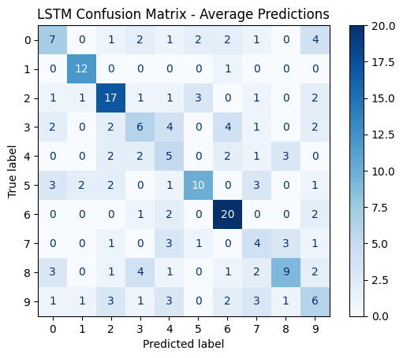
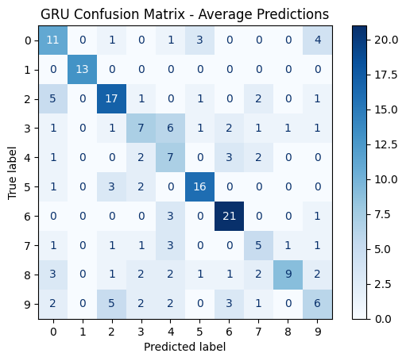

### Exploration notebook
##### Visualize audio file
'y' is a table containing the amplitude values ​​of the sound (sound wave).  
'sr' (sample rate) is the number of samples per second, which indicates how often the values ​​are measured.  

Waveform: visual representation of variations in the audio signal that shows the amplitude (or intensity) over time.  
Spectrogram: 3D representation (time, frequency, intensity) that shows how the energy (amplitude) of the signal is distributed across different frequencies over time.  

##### Visualize audio features
MFCCs (Mel-Frequency Cepstral Coefficients) are popular features in sound analysis and music recognition. They capture the spectral envelope of sound, which makes them useful for modeling musical timbres and vocal sounds.  

Chroma characteristics represent the intensity of different pitches (notes) in the chromatic scale (12 notes). This can be useful for capturing harmony and tone.  

Tonnetz is a concept used in music to represent the harmonic relationships between notes, chords and tones.  

##### Select features
Using a Random Forest model and its feature importance property to determine which audio features most influence predictions.  
Definition of an importance threshold to reduce the dimensionality of the dataset and keep only the most relevant audio characteristics. Here we keep 35 out of 42.  

##### Prepare data
Standardizing data with StandardScaler to prevent certain features from dominating others simply because of their scale.  
Resizing the data in 3D so that the format is suitable for the use of RNN (LSTM and GRU) and CNN (Conv1D) models.  
Separation of data into a training set and a test set.  
One-hot encoding on labels to train models.  

##### Construct classification models
Construction of 3 classification models:  
- LSTM: Captures complex temporal relationships with long-term memory.  
- GRU: Similar to LSTM, but with a simpler architecture and faster to train.  
- CNN: Captures local patterns in audio data.  

##### Evaluate classification models
Probability predictions of each model for each class on the test set.  
Average of the probabilities of the three models calculated to combine the results.  
An average accuracy of 64.5% is achieved with the following individual scores:  
- LSTM: 48%  
- GRU: 56%  
- CNN: 67%  

The classes predicted by each model are combined by majority vote. The accuracy of this vote is also calculated.  
Here we obtain an average score of 62%.  

##### Confusion matrix
Visualization of the confusion matrices of each model.  
- LSTM:  
  

- GRU:  
  

- CNN:  
  
